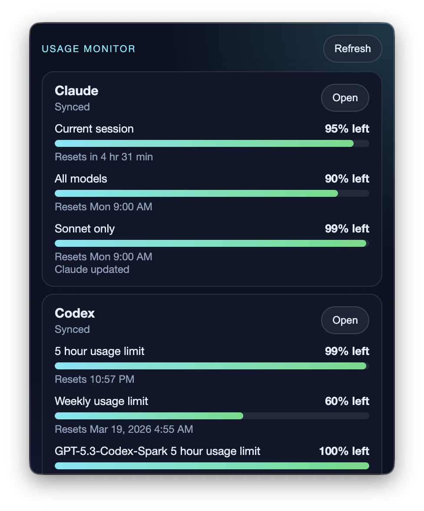

# Usage Menubar

A macOS menubar app that tracks your [Claude](https://claude.ai) and [Codex](https://chatgpt.com/codex) usage in real time. See remaining quotas at a glance without leaving your editor.

<p align="center">
  
</p>

## Features

- **Menubar display** — remaining percentages (`C 95%  O 99%`) always visible in the macOS menu bar
- **Claude tracking** — current session, all models, and Sonnet-only usage with reset timers
- **Codex tracking** — 5-hour and weekly limits, per-model breakdowns
- **Chrome cookie import** — automatically imports your Chrome login session so you don't have to log in again
- **Chrome DevTools bridge** — connects to a running Chrome via DevTools Protocol for seamless data collection
- **Auto-refresh** — updates every 5 minutes in the background
- **Built-in login** — open the provider login page directly from the app when needed

## Requirements

- macOS
- Node.js ≥ 18
- [pnpm](https://pnpm.io/)
- Active [Claude Pro](https://claude.ai) and/or [Codex](https://chatgpt.com/codex) subscription

## Install

```bash
git clone https://github.com/iritec/usage-menubar.git
cd usage-menubar
pnpm install
```

## Usage

### Development

```bash
pnpm dev
```

Click the bar-chart icon in the menubar to open the popup, then press **Refresh** to pull your latest usage.

### First-time setup

1. Click **Login** next to Claude or Codex to authenticate in the built-in browser
2. Once logged in, click **Refresh** — your remaining quotas will appear
3. The app remembers your session across restarts

> **Tip:** If you're already logged into Claude/Codex in Chrome, the app can import your cookies automatically — no manual login needed.

### Build

```bash
pnpm dist      # produces a distributable .zip for macOS
```

## Configuration

| Environment variable | Description |
|---|---|
| `USAGE_MONITOR_CLAUDE_URL` | Override the Claude usage page URL |
| `USAGE_MONITOR_CODEX_URL` | Override the Codex usage page URL |
| `USAGE_MONITOR_CHROME_WS_ENDPOINT` | Chrome DevTools WebSocket endpoint |
| `USAGE_MONITOR_CHROME_BROWSER_URL` | Chrome DevTools browser URL |
| `USAGE_MONITOR_USER_DATA_DIR` | Custom Electron user data directory |

## Built with KingCoding

This app was built with [KingCoding](https://kingcode.shingoirie.com/) — an AI-powered coding assistant that lets you ship real apps fast.

## License

[MIT](LICENSE)
